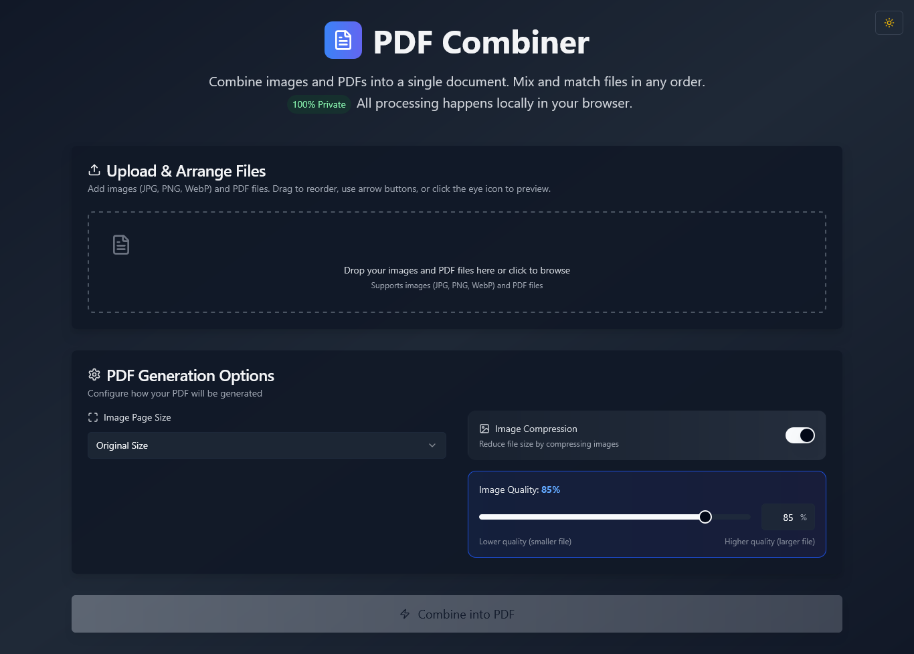

<h1 align="center">
  <br>
  PDF Combiner
  <br>
</h1>

<h4 align="center">Vite + React + TypeScript + Tailwind CSS + Zod</h4>

<p align="center">
  <a href="#key-features">Key Features</a> •
  <a href="#how-to-use">How To Use</a> •
  <a href="#tech-stack">Tech Stack</a> •
  <a href="#license">License</a>
</p>



## About

The **PDF Combiner** is a powerful and intuitive web-based tool that allows you to effortlessly merge various image formats (JPG, PNG, WebP) and PDF documents into a single, cohesive PDF file. All processing is done locally in your browser, ensuring 100% privacy and security for your files.

Mix and match your files in any order, arrange them with simple drag-and-drop functionality, and configure PDF generation options to suit your needs.

Built using Gemini and Lovable!

## Key Features

*   **Seamless File Combination:** Merge images (JPG, PNG, WebP) and PDF files into one unified document.
*   **Intuitive Drag & Drop Interface:** Easily upload and reorder your files with a user-friendly drag-and-drop system.
*   **100% Private:** All file processing occurs directly within your browser, ensuring your documents never leave your device.
*   **Flexible Arrangement:** Reorder files using drag-and-drop, arrow buttons, or preview them with a click.
*   **Image Page Size Control:** Choose between "Original Size" or other options for image-based pages.
*   **Image Compression:** Reduce the output PDF file size by applying image compression.
*   **Modern & Responsive UI:** Built with ShadCN UI and Tailwind CSS for a sleek and adaptable user experience.
*   **Robust Form Validation:** Utilizes Zod for reliable input validation.

## How To Use

To get started with the PDF Combiner locally, follow these steps:

To clone and run this application, you'll need [Git](https://git-scm.com) and [Node.js](https://nodejs.org/en/download/) (which comes with [npm](http://npmjs.com) or [pnpm](https://pnpm.io/)).

```bash
# Clone this repository
$ git clone https://github.com/kunalagra/img-pdf-utils

# Go into the repository
$ cd img-pdf-utils

# Install dependencies (using npm or pnpm)
$ npm install # or pnpm install

# Run the app in development mode
$ npm run dev # or pnpm run dev
```

This will start the development server, and you can access the application in your browser, usually at `http://localhost:5173`.

To create a production-ready build:

```bash
# Build the application
$ npm run build # or pnpm run build
```

The compiled output will be available in the `dist` directory.

## Tech Stack

This project is built with the following technologies:

*   **Frontend Framework:** [React](https://react.dev/)
*   **Build Tool:** [Vite](https://vitejs.dev/)
*   **Language:** [TypeScript](https://www.typescriptlang.org/)
*   **Styling:** [Tailwind CSS](https://tailwindcss.com/)
*   **UI Components:** [ShadCN UI](https://ui.shadcn.com/)
*   **Form Validation:** [Zod](https://zod.dev/)
*   **PDF Manipulation:** [pdf-lib](https://pdf-lib.js.org/)

## License

This project is licensed under the **GPL-3.0** license. See the `LICENSE` file for more details.